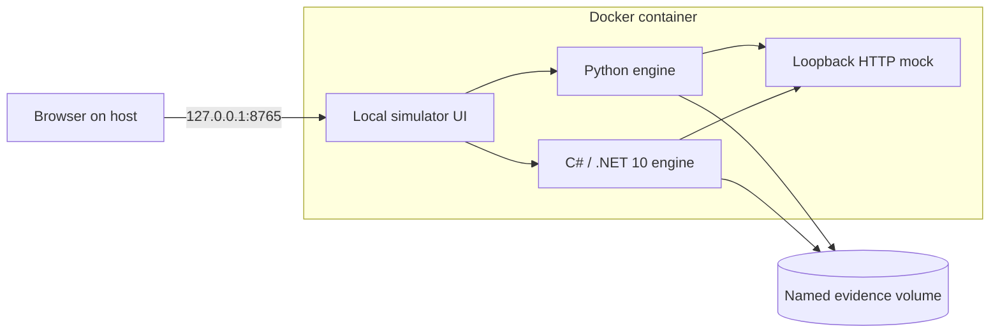

# Microsoft Foundry Throttling Samples

**Understand HTTP 429. Compare retries and pacing. Follow the evidence.**

[](https://github.com/ppiova/microsoft-foundry-throttling-samples/actions/workflows/tests.yml)


[](LICENSE)

Built by **[Pablo Piovano](https://github.com/ppiova)** &middot; **Microsoft MVP &middot; Docker Captain**

**[Read the presentation as a PDF](output/pdf/understanding-and-mitigating-http-429.pdf)** — 14 slides in US English, with clickable references and code links. No installation or repository clone required. This public edition contains no speaker notes.

A hands-on lab with independent **Python** and **C# / .NET 10** engines, a browser UI, and fourteen HTML slides. Explore how a burst becomes HTTP attempts, how bounded retries affect completion, and how pacing changes arrival times.

**[Quick start](#quick-start-with-docker) &middot; [Choose your language](#choose-your-language) &middot; [Slides](#explore-the-ui-and-slides) &middot; [Azure](#bring-your-own-azure-deployment) &middot; [Tests](#tests-and-contributions)**

> Independent community project. Not an official Microsoft or Docker product. The default experience uses synthetic local HTTP responses and requires no Azure account or API keys.

## What can you learn?

| Question | Experiment | What to inspect |
|---|---|---|
| What happens when requests arrive together? | **Burst** | Completion and HTTP 429 responses |
| What does recovery cost? | **Retry with backoff** | Logical requests versus total attempts |
| Can changing arrival times help? | **Paced requests** | Send intervals, queueing and outcomes |
| Did the change improve the result? | **Compare** | Matched workload, attempts and end-to-end time |

The UI supports **Azure OpenAI** and **Microsoft MAI** adapters. The CLIs also include Claude and MAI image adapters. Live model availability and provider-specific limits must be verified in your own subscription.

## Quick start with Docker

Install [Docker Desktop](https://docs.docker.com/get-started/get-docker/) or Docker Engine with the Compose plugin, then:

```bash
git clone https://github.com/ppiova/microsoft-foundry-throttling-samples.git
cd microsoft-foundry-throttling-samples
docker compose up --build -d
```

| Open | Address |
|---|---|
| **Interactive lab** | http://127.0.0.1:8765 |
| **HTML slides** | http://127.0.0.1:8765/slides |

**Python and .NET are included in the container.** You do not need either runtime installed on your host. The first build downloads base images and dependencies; subsequent builds can reuse cached layers.

Select **Python** or **C# / .NET 10**, then run **Burst**, **Retry with backoff**, and **Paced requests**. Each UI execution uses six requests, three workers, a 128-token output cap and a two-second synthetic RPM window. No Azure inference calls are made by the UI.

```bash
docker compose ps          # Container health
docker compose logs -f lab # Server output
docker compose down        # Stop; keep saved evidence
```

Evidence lives in a named Docker volume and survives container recreation. `docker compose down --volumes` also deletes that evidence; use it only when you want a fresh lab.

### Run either CLI in the container

These commands use the same image and evidence volume as the UI:

```bash
# Python
docker compose run --rm lab python /app/python/lab.py run --config /app/python/config.example.json --scenario retry --out /data/python/runs

# C# / .NET 10
docker compose run --rm lab dotnet /app/published/FoundryLab.dll run --config /app/dotnet/config.example.json --scenario retry --out /data/dotnet/runs
```

Refresh evidence in the UI after the command finishes. Avoid running CLI experiments concurrently with UI simulations when comparing timings.

### Container design



- **Multi-stage build:** .NET compiles in the SDK stage; the runtime includes the published app and Python.
- **Local-only published port:** Compose binds to `127.0.0.1`. Use that address to satisfy the server's Host and Origin checks.
- **Non-root execution:** a read-only root filesystem, writable evidence volume and temporary directory, dropped Linux capabilities, and a health check.
- **Two entry points:** `local` serves the simulator; the default `cloud` target requires configured Entra authentication behind Azure Container Apps Easy Auth.

The local target is for workstation use. Do not publish it as an anonymous internet service. See the [Compose configuration](compose.yaml), [Dockerfile](Dockerfile), and [Docker Compose documentation](https://docs.docker.com/compose/gettingstarted/).

## Choose your language

Prefer to run directly on your machine? Execute these commands from the repository root.

| Path | Requirement | Source |
|---|---|---|
| **Python** | Python 3.10+; standard library for local simulation | [python/](python/) |
| **C#** | .NET SDK 10 | [dotnet/FoundryLab/](dotnet/FoundryLab/) |
| **Browser UI** | Python; .NET SDK if selecting C# | [demo/](demo/) |

### Python

```bash
python python/lab.py run --config python/config.example.json --scenario burst --out python/runs
python python/lab.py run --config python/config.example.json --scenario retry --out python/runs
python python/lab.py run --config python/config.example.json --scenario paced --out python/runs
python python/lab.py run --help
```

### C# / .NET 10

```bash
dotnet run --project dotnet/FoundryLab --configuration Release -- run --scenario burst --out dotnet/runs
dotnet run --project dotnet/FoundryLab --configuration Release -- run --scenario retry --out dotnet/runs
dotnet run --project dotnet/FoundryLab --configuration Release -- run --scenario paced --out dotnet/runs
```

### UI without Docker

```bash
python demo/server.py
```

Open http://127.0.0.1:8765. Stop the Compose service first if it already occupies that port. The first native C# run may restore NuGet dependencies.

Both engines implement `preflight`, `baseline`, `burst`, `retry`, `paced` and `guarded`. CLI mock axes include `rpm`, `tpm`, `itpm`, `otpm` and `capacity`; the browser UI uses `rpm`. Generated reports and local configurations are ignored by Git.

## Explore the UI and slides

1. **Choose a strategy** to configure the next simulation.
2. **Run it**, then inspect completion, attempts, 429 responses and the timeline.
3. **Compare** compatible experiments with the same workload and service conditions.
4. **Open the logs** to follow repeated attempts for one logical request.
5. **Replay** a saved execution: timestamps animate, while KPI cards retain final totals.

The [fourteen-slide deck](demo/slides.html) covers the concepts and links to the lab. Open `/slides` through the running server. Use arrow keys, Page Up/Down, Home/End, the slide selector, or **F** for full screen. The public deck contains no speaker notes or presenter mode.

For reading or sharing without running the lab, use the [PDF edition](output/pdf/understanding-and-mitigating-http-429.pdf). The PDF includes the same content in a layout for reading. Its demo link opens the setup instructions rather than a private Azure application.

Maintainers can regenerate the PDF from the public HTML with `python -m pip install reportlab` followed by `python scripts/export_slides_pdf.py`. Review the rendered PDF after updating the slides.

**Recorded Azure run** is read-only and starts empty. Collect your own evidence with the CLI if you want to explore that mode; no live recordings are distributed here.

## Read the evidence carefully

> **A synthetic 429 is a teaching example, not a measurement of Azure capacity.**

Retries may improve completion while increasing attempts and waiting. Pacing can still encounter rejections. A concurrency limit is not a fixed request-rate limit. End-to-end timing includes queueing, retry waits and HTTP time; these small workloads are not model or language benchmarks.

HTTP success and completed generation are separate measurements. These experiments alone do not establish that another subscription or more quota would solve a production incident.

## Bring your own Azure deployment

Live CLI execution requires explicit `--live`, your own deployment, authorized identity and verified capacity. It can incur charges. Run it from a configured host environment; the local Docker quick start does not mount Azure credentials or install Azure CLI.

1. Copy your language's `config.example.json` to `config.local.json`.
2. Replace deployment/model/region placeholders and set the target's endpoint environment variable.
3. Run `az login`, select your subscription, and verify the appropriate inference permissions. The default credential type is `azure_cli`.
4. For Python live Entra calls, install `python/requirements-live.txt`.
5. Start with a single preflight:

```bash
python -m pip install -r python/requirements-live.txt
python python/lab.py run --config python/config.local.json --target aoai --scenario preflight --live --out python/runs
```

Use `mai`, `claude` or `image` only after configuring and verifying that target. Keep local configurations, keys, tokens, endpoints and raw live reports out of commits and issues.

### Infrastructure as code

[Foundry Bicep](infra/main.bicep) and [example parameters](infra/parameters.example.json) describe resource creation. Review the region, model versions and capacity before using PowerShell 7 and Azure CLI:

```powershell
./infra/deploy.ps1 -SubscriptionId YOUR-SUBSCRIPTION-ID -Mode WhatIf
```

The wrapper defaults to `WhatIf`; deployment requires `-Mode Deploy`. Claude requires real organization details and explicit `-AcceptClaudeMarketplaceTerms`. Cloning or simulating accepts no provider terms.

[Hosting](infra/hosting.bicep) and [Container Apps](infra/container-app.bicep) templates are available for authenticated hosting. The default Docker target fails closed until access is configured. Supply your own single-tenant app registration, assignments, allowed users and managed-identity federation. The cloud app trusts identity headers only behind Container Apps Easy Auth.

## Tests and contributions

```bash
python -m unittest discover -s python/tests -v
python -m pip install -r demo/requirements-cloud.txt
python -m unittest discover -s demo -p "test_*.py" -v
node --test demo/test_ui.cjs
dotnet test dotnet/FoundryLab.Tests --configuration Release
python scripts/validate_parity.py
```

Node.js 18+ is needed for UI regression tests. CI checks Python and .NET on Windows/Linux, evidence compatibility, Bicep, cloud container boundaries, and the local Compose workflow. Local tests require no Azure credentials.

[Report an issue](https://github.com/ppiova/microsoft-foundry-throttling-samples/issues) with runtime versions, synthetic settings and a minimal reproduction. Focus pull requests on one change and include relevant validation.

## Keep learning

- [Azure OpenAI quota management](https://learn.microsoft.com/en-us/azure/foundry/openai/how-to/quota?WT.mc_id=AI-MVP-5004753)
- [Retry pattern](https://learn.microsoft.com/en-us/azure/architecture/patterns/retry?WT.mc_id=AI-MVP-5004753)
- [Foundry access control](https://learn.microsoft.com/en-us/azure/foundry/concepts/rbac-foundry?WT.mc_id=AI-MVP-5004753)
- [Docker Compose quick start](https://docs.docker.com/compose/gettingstarted/)

---

**Pablo Piovano &middot; Microsoft MVP &middot; Docker Captain** &middot; [GitHub](https://github.com/ppiova)
Released under the [MIT License](LICENSE).
