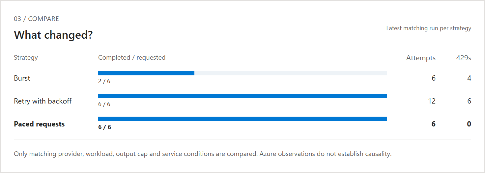
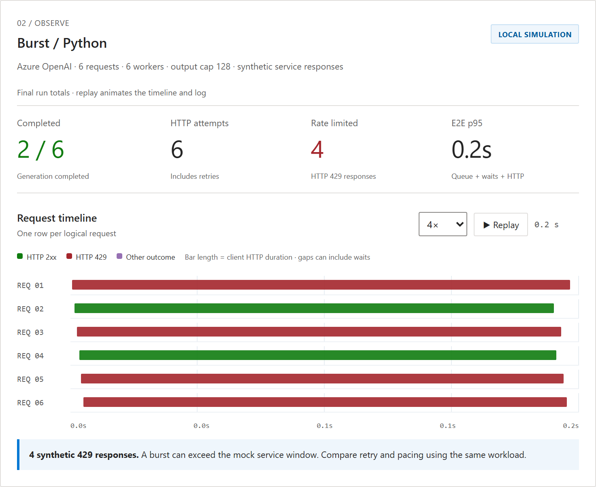
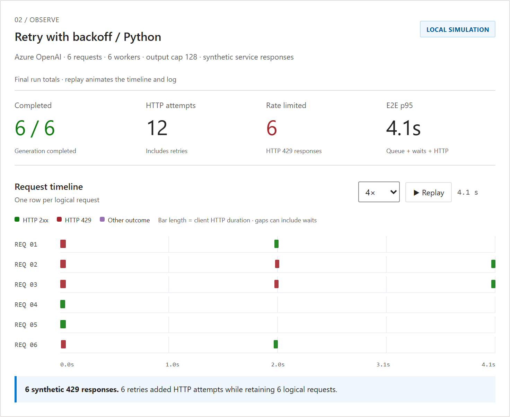
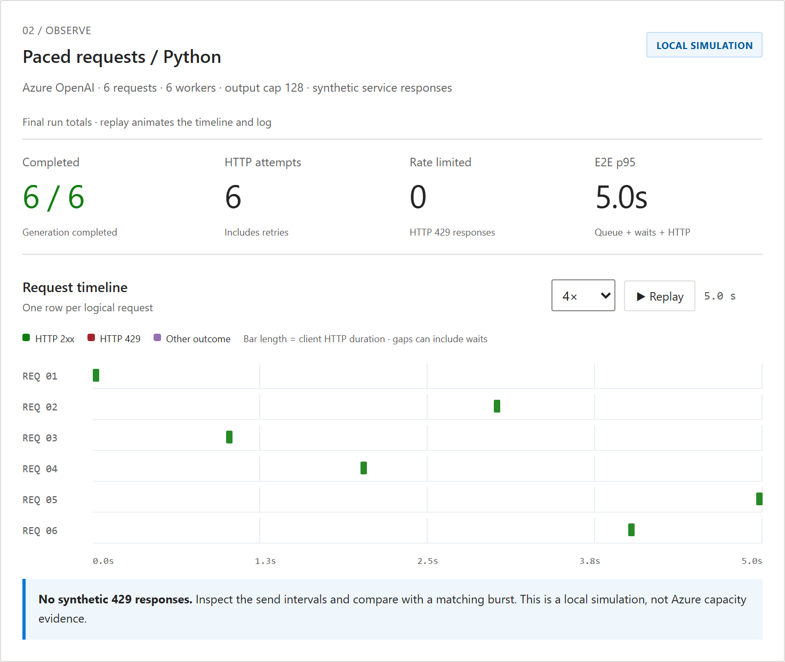

# Reference Run: Burst, Retry and Pacing on the Same Workload

> **These numbers come from a local HTTP simulator, not from Azure.** A synthetic 429 is a
> teaching example, not a measurement of Microsoft Foundry capacity. Reproduce them on your
> machine in under a minute, then run the same comparison against your own deployment.

The three scenarios below send the **same logical workload**: 6 requests, 6 workers, a 128 token
output cap, against a mock service that accepts 2 requests per 2 second window. Only the client
side control changes.

## What changed

| Scenario | Completed | HTTP attempts | 429s | 429 rate | E2E p95 | Client control |
|---|---:|---:|---:|---:|---:|---|
| **Burst** | 2 / 6 | 6 | 4 | 66.7% | 0.16 s | none |
| **Retry with backoff** | 6 / 6 | 12 | 6 | 50.0% | 4.07 s | up to 3 attempts per request |
| **Paced requests** | 6 / 6 | 6 | 0 | 0.0% | 5.01 s | admission at 60 RPM |



## Three readings that matter

**1. Burst is not fast, it fails fast.** The 0.16 s end to end looks like the best number in the
table. It is the cost of rejecting two thirds of the workload in one window. Latency measured over
failed requests answers a different question than latency measured over completed work.

**2. Retry buys completion with attempts.** Completion goes from 2/6 to 6/6, and HTTP attempts go
from 6 to 12. Those extra attempts are load the service still has to reject, and on a real
deployment they are also billed requests against your rate limit. Retry recovers after the fact; it
does not reduce the pressure that caused the 429.

**3. Pacing changes the arrival pattern, not the budget.** Same 6 attempts as burst, zero 429s, and
full completion. The price is wall clock time: 5.01 s versus 4.07 s for retry. Pacing prevents the
rejection instead of recovering from it, which is why its attempt count matches the ideal case.

Retry and pacing are **not alternatives**. Pacing controls how requests arrive; retry decides what
happens when one is rejected anyway. A production client usually needs both, plus a bounded budget
so recovery terminates.

## Evidence per scenario

### Burst: no client control



Six requests reach the service inside the same window. Four are rejected, and with no retry those
four are simply lost. Notice the timeline: every bar starts at the same moment.

### Retry with backoff: bounded recovery



The same six requests, now with up to three attempts each. The timeline shows the retry waits as
gaps: rejected requests reenter admission after the delay. `retry_delay()` prioritizes the server's
`Retry-After` header and falls back to exponential backoff with jitter. If the required wait exceeds
the remaining deadline, the request stops rather than sending early.

### Paced requests: prevention



Admission control spaces the sends at one per second. No request is ever rejected, so no attempt is
wasted. The staircase in the timeline is the control working.

## Reproduce this

```bash
python python/lab.py run --config python/config.example.json --scenario burst --out python/runs
python python/lab.py run --config python/config.example.json --scenario retry --out python/runs
python python/lab.py run --config python/config.example.json --scenario paced --out python/runs
```

Or run the identical scenarios on the C# / .NET 10 engine:

```bash
dotnet run --project dotnet/FoundryLab --configuration Release -- run --scenario burst --out dotnet/runs
dotnet run --project dotnet/FoundryLab --configuration Release -- run --scenario retry --out dotnet/runs
dotnet run --project dotnet/FoundryLab --configuration Release -- run --scenario paced --out dotnet/runs
```

Each run writes `manifest.json` (the exact conditions), `summary.json` (the metrics above),
`attempts.jsonl` (one line per HTTP attempt) and `report.md`. The screenshots on this page are the
browser UI reading those same files.

### Both engines agree

The two implementations are independent, not a port of one another, and they produce the same
completion, attempt and 429 counts on this workload:

```
python burst complete= 2 attempts= 6  429= 4
python retry complete= 6 attempts= 12 429= 6
python paced complete= 6 attempts= 6  429= 0
dotnet burst complete= 2 attempts= 6  429= 4
dotnet retry complete= 6 attempts= 12 429= 6
dotnet paced complete= 6 attempts= 6  429= 0
```

`python scripts/validate_parity.py` runs both engines and asserts the evidence is cross-runtime
comparable. The behavior described here is a property of the control strategy, not of the language.

## How to read these numbers carefully

- **Timing values vary between runs.** The completion and attempt counts are deterministic for this
  mock; the millisecond timings are not. Re-run before quoting a specific latency.
- **With six requests, p95 is effectively the worst case.** Useful for teaching, not for estimating
  a production SLO.
- **HTTP success and completed generation are separate measurements.** A 200 response truncated by
  the output cap is not counted as complete.
- **A concurrency limit is not a request rate limit.** Six workers does not mean six requests per
  second; see [CODE-GUIDE.md](CODE-GUIDE.md#3-concurrency-and-pacing-are-different-controls).
- **This comparison does not establish causality in Azure.** Other workloads sharing your quota pool
  can change between runs. Before concluding that you need more capacity, fill in the
  [incident template](INCIDENT-TEMPLATE.md).

Microsoft documentation for every provider specific claim is mapped in [SOURCES.md](SOURCES.md).
